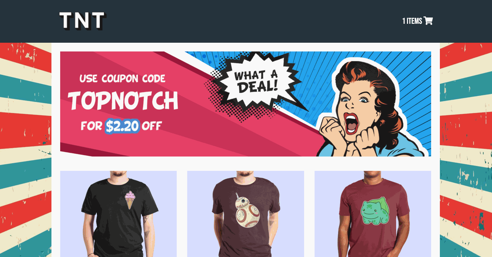

# Top-Notch Tees
A full stack Node.js and React E-commerce web application.

#### Live Site
Check out the live site here - [Top Notch Tees](https://top-notch.steventrancodes.com)

#### Technologies
* React.js
* Node.js
* Express
* PostgreSQL
* Webpack 4
* HTML5
* CSS3
* Bootstrap 4
* AWS EC2

#### Features
* User can view a list of products
* User can view a product's details
* User can add products to their shopping cart
* User can view shopping cart
* User can checkout and place an order
* User can view on mobile devices

#### Preview


#### System Requirements
* Node.js (10 or higher)
* NPM (6 or higher)
* PostgreSQL

#### Getting Started
1. Clone the repository and navigate to the directory.
```shell
git clone https://github.com/steventran815/wicked-sales-js.git
cd wicked-sales-js
```
2. Install all dependencies with NPM.
```shell
npm install
```
3. Initialize PostgreSQL server
```shell
sudo service postgresql start
```
4. Import existing example database.
```shell
npm run db:import
```
5. Start the project. Once your system finishes compiling, you can view the application by opening http://localhost:3000 in your browser.
```shell
npm run dev
```
